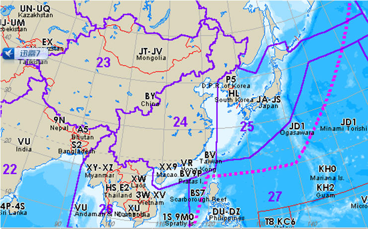
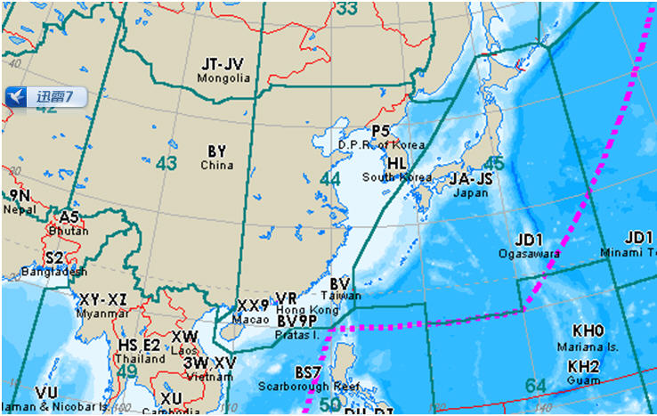

# QSL-card
### 这里是BG2GER QSL卡片的范例储存库
- ~~技术太垃圾拿word凑出来了~~
请使用word编辑你自己的呼号
### 填写说明—
- CQ zone:官方划分的区域，见下图
  
  
  
- ITQ zone:同样的，另一种划分方法
  
  
- TO RADIO：对方呼号
- DATE：日期
- TIME: 时间
  UTC:标准世界时  <https://time.is/zh/UTC>  
  BJT：北京时间   <https://time.is/zh/Beijing>
- MHZ(freq):频率
- MODE:工作模式（分为FM、USB、CW，UV段一般填FM）
- RST：对方的信号报告 （例如：CW--599 SSTV--595 FM/SSB--59）
- RIG：所用设备（电台型号）
- WATTS:电台功率
- ANT：天线
- PSE：主动寄出卡片时勾选此项
- QTH：地址（自己的地址）
- OP：OP：自己的姓名
